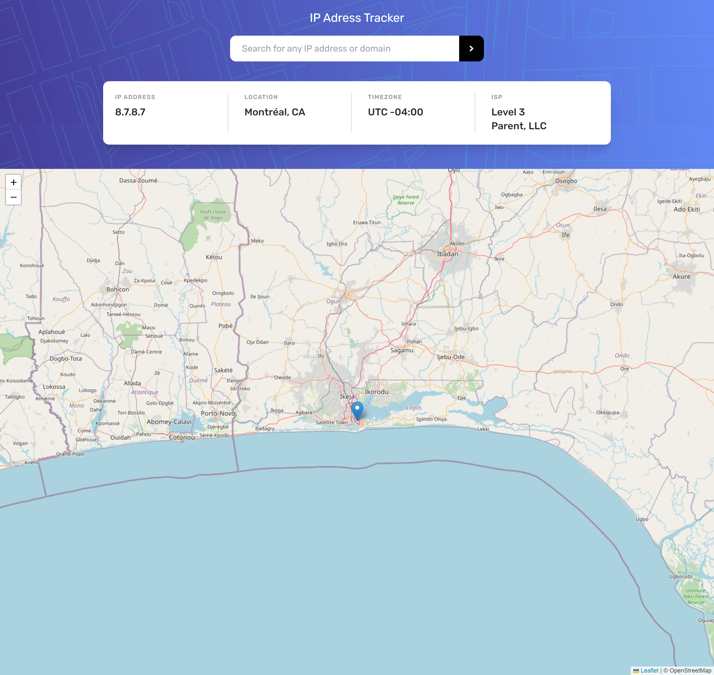

# Frontend Mentor - IP address tracker solution

This is a solution to the [IP address tracker challenge on Frontend Mentor](https://www.frontendmentor.io/challenges/ip-address-tracker-I8-0yYAH0). Frontend Mentor challenges help you improve your coding skills by building realistic projects.

## Table of contents

-   [Overview](#overview)
    -   [The challenge](#the-challenge)
    -   [Screenshot](#screenshot)
    -   [Links](#links)
-   [My process](#my-process)
    -   [Built with](#built-with)
    -   [What I learned](#what-i-learned)
    -   [Continued development](#continued-development)
    -   [Useful resources](#useful-resources)
-   [Author](#author)
-   [Acknowledgments](#acknowledgments)

## Overview

### The challenge

Users should be able to:

-   View the optimal layout for each page depending on their device's screen size
-   See hover states for all interactive elements on the page
-   See their own IP address on the map on the initial page load
-   Search for any IP addresses or domains and see the key information and location

### Screenshot

### Links

-   Solution URL: [IP Address Tracker](https://github.com/Oluwafemi21/ip-address-tracker)
-   Live Site URL: [Add live site URL here](https://your-live-site-url.com)

## My process

### Built with

-   Semantic HTML5 markup
-   CSS custom properties
-   Flexbox
-   CSS Grid
-   Mobile-first workflow
-   [Vue](https://vuejs.org/) - JS library
-   [TailwindCss](https://tailwindcss.com/) - Css Framework

### What I learned

I learnt how to use the leaflet map to embed a live map in the project

### Continued development

-   API calls
-   Effective usage of axios

## Author

-   Frontend Mentor - [@Oluwafemi21](https://www.frontendmentor.io/profile/Oluwafemi21)
-   Twitter - [@femi_io](https://www.twitter.com/femi_io)

## Acknowledgments

I want to thank myself for finishing this project
